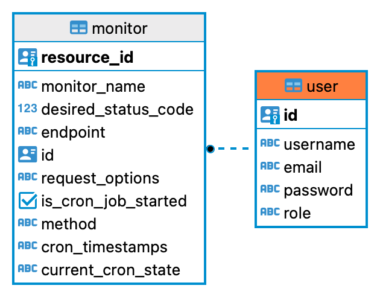

<p align="center">
  <a href="http://nestjs.com/" target="blank"></a>
</p>

[circleci-image]: https://img.shields.io/circleci/build/github/nestjs/nest/master?token=abc123def456
[circleci-url]: https://circleci.com/gh/nestjs/nest

## Description

NestJS API for Server Monitoring with instructions for use (using a pre-setup Postman workplace)

# Use with Local Installation


Use <a href="https://tinyurl.com/334ztzyp/" target="_blank"><b><u>Server Monitor Postman Collection</b></u></a> to open the Postman Collection. Open the body for "Create User" and insert your credentials. Then, generate a JWT Token. You can then create a server monitor and configure your "options" (part of the fetch, where you can provide headers, CORS policy, HTTP method/request body, etc). Finally you start the server monitoring with associated email notifications. Please use the Delete Server Monitor GraphQL endpoint to delete your server monitor.

# Basic ER Diagram for Database Schema




## Installation

```bash
$ npm install
```

## Running the app

```bash
# development
$ npm run start

# watch mode
$ npm run start:dev

# production mode
$ npm run start:prod
```

## Test

```bash
# unit tests
$ npm run test

# e2e tests
$ npm run test:e2e

# test coverage
$ npm run test:cov
```


